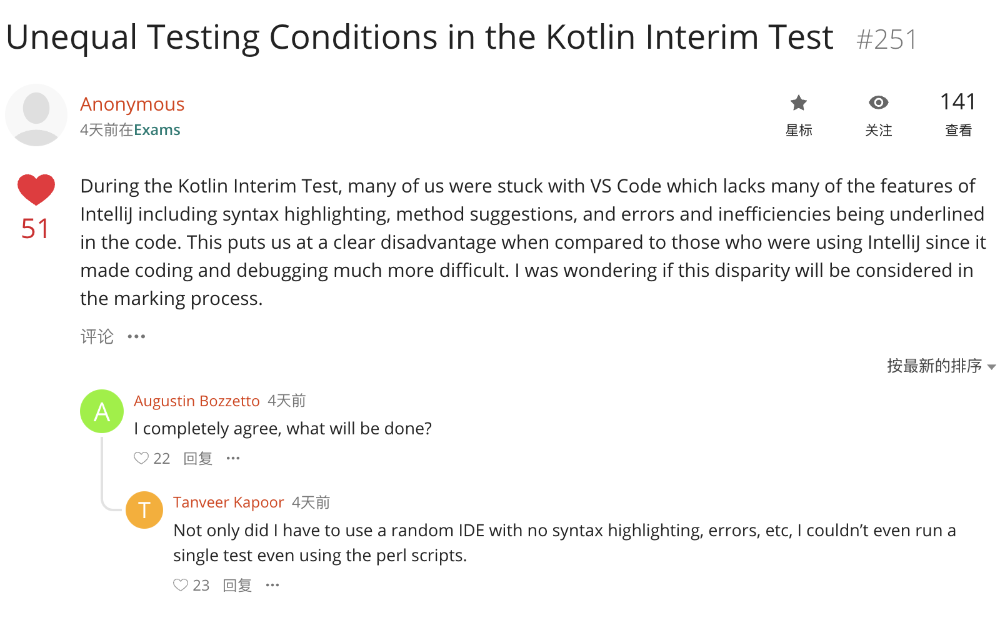
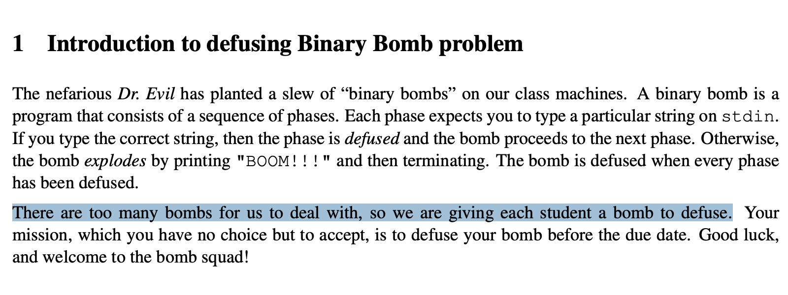
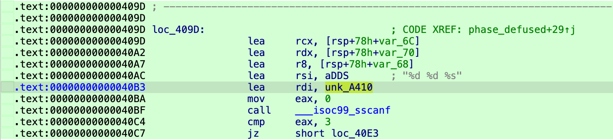

## 前言

为什么大家都在截止时间之前这么多写作业，我在考完 Kotlin 之前是不会动它的！



## 读题



在 @Dyrox 老师的建议下，先不管要干啥，拿 IDA 打开再说。

哦原来给了主函数的 C 源码啊，早说嘛

<details>
<summary><code>bomb.c</code></summary>
<div markdown="1">

```c title="bomb.c"
/***************************************************************************
 * Dr. Evil's Insidious Bomb, Version 1.1
 * Copyright 2011, Dr. Evil Incorporated. All rights reserved.
 *
 * LICENSE:
 *
 * Dr. Evil Incorporated (the PERPETRATOR) hereby grants you (the
 * VICTIM) explicit permission to use this bomb (the BOMB).  This is a
 * time limited license, which expires on the death of the VICTIM.
 * The PERPETRATOR takes no responsibility for damage, frustration,
 * insanity, bug-eyes, carpal-tunnel syndrome, loss of sleep, or other
 * harm to the VICTIM.  Unless the PERPETRATOR wants to take credit,
 * that is.  The VICTIM may not distribute this bomb source code to
 * any enemies of the PERPETRATOR.  No VICTIM may debug,
 * reverse-engineer, run "strings" on, decompile, decrypt, or use any
 * other technique to gain knowledge of and defuse the BOMB.  BOMB
 * proof clothing may not be worn when handling this program.  The
 * PERPETRATOR will not apologize for the PERPETRATOR's poor sense of
 * humor.  This license is null and void where the BOMB is prohibited
 * by law.
 ***************************************************************************/

#include <stdio.h>
#include <stdlib.h>
#include "support.h"
#include "phases.h"

/*
 * Note to self: Remember to erase this file so my victims will have no
 * idea what is going on, and so they will all blow up in a
 * spectaculary fiendish explosion. -- Dr. Evil
 */

FILE *infile;

int main(int argc, char *argv[])
{
    char *input;

    /* Note to self: remember to port this bomb to Windows and put a
     * fantastic GUI on it. */

    /* When run with no arguments, the bomb reads its input lines
     * from standard input. */
    if (argc == 1) {
        infile = stdin;
    }

    /* When run with one argument <file>, the bomb reads from <file>
     * until EOF, and then switches to standard input. Thus, as you
     * defuse each phase, you can add its defusing string to <file> and
     * avoid having to retype it. */
    else if (argc == 2) {
        if (!(infile = fopen(argv[1], "r"))) {
            printf("%s: Error: Couldn't open %s\n", argv[0], argv[1]);
            exit(8);
        }
    }

    /* You can't call the bomb with more than 1 command line argument. */
    else {
        printf("Usage: %s [<input_file>]\n", argv[0]);
        exit(8);
    }

    /* Do all sorts of secret stuff that makes the bomb harder to defuse. */
    initialize_bomb();

    printf("Welcome to my fiendish little bomb. You have 6 phases with\n");
    printf("which to blow yourself up. Have a nice day!\n");

    /* Hmm...  Six phases must be more secure than one phase! */
    input = read_line();             /* Get input                   */
    phase_1(input);                  /* Run the phase               */
    phase_defused();                 /* Drat!  They figured it out!
                                      * Let me know how they did it. */
    printf("Phase 1 defused. How about the next one?\n");

    /* The second phase is harder.  No one will ever figure out
     * how to defuse this... */
    input = read_line();
    phase_2(input);
    phase_defused();
    printf("That's number 2.  Keep going!\n");

    /* I guess this is too easy so far.  Some more complex code will
     * confuse people. */
    input = read_line();
    phase_3(input);
    phase_defused();
    printf("Halfway there!\n");

    /* Oh yeah?  Well, how good is your math?  Try on this saucy problem! */
    input = read_line();
    phase_4(input);
    phase_defused();
    printf("So you got that one.  Try this one.\n");

    /* Round and 'round in memory we go, where we stop, the bomb blows! */
    input = read_line();
    phase_5(input);
    phase_defused();
    printf("Good work!  On to the next...\n");

    /* This phase will never be used, since no one will get past the
     * earlier ones.  But just in case, make this one extra hard. */
    input = read_line();
    phase_6(input);
    phase_defused();

    /* Wow, they got it!  But isn't something... missing?  Perhaps
     * something they overlooked?  Mua ha ha ha ha! */

    return 0;
}
```

</div>
</details>

## 运行

因为笔者在用苹果硅，而给的 executable 是 `linux/amd64` 平台的：

```console showLineNumbers=false
% file bomb
bomb: ELF 64-bit LSB pie executable, x86-64, version 1 (SYSV), dynamically linked, interpreter /lib64/ld-linux-x86-64.so.2, BuildID[sha1]=7ee5ec8aa3a4b4234931f7fd4e06506e2ee1a710, for GNU/Linux 3.2.0, with debug_info, not stripped
```

很自然地想到我们可以用 Docker 来执行它。

:::note[安装 Docker]

在 macOS 中，我们可以使用 [Homebrew] 来安装 [Docker Desktop]：

```shell showLineNumbers=false
brew install --cask docker
```

:::

```shell showLineNumbers=false
docker run \
    --rm \
    --platform linux/amd64 \
    --network none \
    --volume .:/bomb:ro \
    -it \
    ubuntu:24.04 \
    /bomb/bomb
```

接下来我们将非常频繁地执行这个命令，为了可读性我会按需省略一些不影响的 flag，请确保理解它们的含义：

- `--network none`：关闭网络 防止意外发生
- `--volume .:/bomb:ro`：将当前目录 `.` 挂载在容器里只读的 `/bomb` 位置
- `-i`：保持 stdin 打开，这允许我们输入文本
- `ubuntu:24.04`：使用 Ubuntu 24.04 的 image（和机房机器一样），后文将使用默认 tag `latest` 而不指定 `24.04`
- `/bomb/bomb`：在容器里执行的命令，这里我们使用了 executable 的绝对路径

## 补丁

> [!TIP]
> 在后面的步骤中你可能会想要用 IDA Pro 的这个 [Patching] 插件。

### Running on an illegal host

执行这条命令，我们迎来了第一个问题：

```console showLineNumbers=false
% docker run --rm --platform linux/amd64 --volume .:/bomb ubuntu /bomb/bomb
Initialization error: Running on an illegal host [2]
% echo $?
8
```

`bomb` 往 stderr 打印了一条错误消息，并返回了 8。

:::note[关于 Exit status]

C 程序的 `main` 函数返回一个 `int`，这是程序的 exit code。也可以在任何地方（例如 `bomb.c` 第 56 行 与 63 行）调用 `stdlib.h` 中的函数 [`void exit(int exit_code)`][exit] 终止程序。在 shell 中，我们可以使用变量 `$?` 拿到上一条命令的返回值。

:::

一个字符串不会凭空产生，它一般就在 `.rodata` 段的某处。打开 IDA 搜索（⌥T）这个字符串，可以发现它位于 0x5290，并在 `initialize_bomb:loc_3C91` 处被使用。

```txt wrap=false showLineNumbers=false
.rodata:0000000000005290 ; const char aInitialization[]
.rodata:0000000000005290 aInitialization db 'Initialization error: Running on an illegal host [2]',0
.rodata:0000000000005290                                         ; DATA XREF: initialize_bomb:loc_3C91↑o
.rodata:00000000000052C5                 align 8
```

> [!TIP]
> 实际上我们观察 `bomb.c`，很容易发现程序在执行 `argc == 1` 分支后没有到 69 行 `printf` 就退出了。在此之前的唯一一个可疑调用就是 67 行 `initialize_bomb();`。

:::note[关于 `argc`]

C 程序的 `main` 函数的签名通常是 `int main(int argc, char *argv[])`，其中 `argc` 是 argument count，`argv` 是 argument value。此处我们执行 executable 时只有一个 arg，即其本身的路径，因此 `argc` 为 1。

:::

点击 `DATA XREF` 跳转到 `initialize_bomb` 函数。

```txt wrap=false showLineNumbers=false
.text:0000000000003C0B ; =============== S U B R O U T I N E =======================================
.text:0000000000003C0B
.text:0000000000003C0B
.text:0000000000003C0B ; unsigned __int64 initialize_bomb()
.text:0000000000003C0B                 public initialize_bomb
.text:0000000000003C0B initialize_bomb proc near               ; CODE XREF: main:loc_3503↑p
.text:0000000000003C0B
.text:0000000000003C0B var_2028        = byte ptr -2028h
.text:0000000000003C0B var_2010        = qword ptr -2010h
.text:0000000000003C0B var_1010        = qword ptr -1010h
.text:0000000000003C0B var_20          = qword ptr -20h
.text:0000000000003C0B
.text:0000000000003C0B ; __unwind {
.text:0000000000003C0B                 endbr64
.text:0000000000003C0F                 push    rbp
.text:0000000000003C10                 push    rbx
.text:0000000000003C11                 sub     rsp, 1000h
.text:0000000000003C18                 or      [rsp+1010h+var_1010], 0
.text:0000000000003C1D                 sub     rsp, 1000h
.text:0000000000003C24                 or      [rsp+2010h+var_2010], 0
.text:0000000000003C29                 sub     rsp, 58h
.text:0000000000003C2D                 mov     rax, fs:28h
.text:0000000000003C36                 mov     [rsp+2068h+var_20], rax
.text:0000000000003C3E                 xor     eax, eax
.text:0000000000003C40                 lea     rsi, sig_handler ; handler
.text:0000000000003C47                 mov     edi, 2          ; sig
.text:0000000000003C4C                 call    _signal
.text:0000000000003C51                 mov     rdi, rsp
.text:0000000000003C54                 mov     esi, 40h ; '@'
.text:0000000000003C59                 call    _gethostname
.text:0000000000003C5E                 test    eax, eax
.text:0000000000003C60                 jnz     short loc_3CA7
.text:0000000000003C62                 mov     rdi, cs:host_table ; s1
.text:0000000000003C69                 lea     rbx, off_9288   ; "texel02.doc.ic.ac.uk"
.text:0000000000003C70                 mov     rbp, rsp
.text:0000000000003C73                 test    rdi, rdi
.text:0000000000003C76                 jz      short loc_3C91
.text:0000000000003C78
.text:0000000000003C78 loc_3C78:                               ; CODE XREF: initialize_bomb+84↓j
.text:0000000000003C78                 mov     rsi, rbp        ; s2
.text:0000000000003C7B                 call    _strcasecmp
.text:0000000000003C80                 test    eax, eax
.text:0000000000003C82                 jz      short loc_3CE2
.text:0000000000003C84                 add     rbx, 8
.text:0000000000003C88                 mov     rdi, [rbx-8]
.text:0000000000003C8C                 test    rdi, rdi
.text:0000000000003C8F                 jnz     short loc_3C78
.text:0000000000003C91
.text:0000000000003C91 loc_3C91:                               ; CODE XREF: initialize_bomb+6B↑j
.text:0000000000003C91                 lea     rdi, aInitialization ; "Initialization error: Running on an ill"...
.text:0000000000003C98                 call    _puts
.text:0000000000003C9D                 mov     edi, 8          ; status
.text:0000000000003CA2                 call    _exit
.text:0000000000003CA7 ; ---------------------------------------------------------------------------
.text:0000000000003CA7
.text:0000000000003CA7 loc_3CA7:                               ; CODE XREF: initialize_bomb+55↑j
.text:0000000000003CA7                 lea     rdi, aInitialization_0 ; "Initialization error: Running on an ill"...
.text:0000000000003CAE                 call    _puts
.text:0000000000003CB3                 mov     edi, 8          ; status
.text:0000000000003CB8                 call    _exit
.text:0000000000003CBD ; ---------------------------------------------------------------------------
.text:0000000000003CBD
.text:0000000000003CBD loc_3CBD:                               ; CODE XREF: initialize_bomb+E3↓j
.text:0000000000003CBD                 lea     rdx, [rsp+2068h+var_2028]
.text:0000000000003CC2                 lea     rsi, aInitialization_1 ; "Initialization error:\n%s\n"
.text:0000000000003CC9                 mov     edi, 1
.text:0000000000003CCE                 mov     eax, 0
.text:0000000000003CD3                 call    ___printf_chk
.text:0000000000003CD8                 mov     edi, 8          ; status
.text:0000000000003CDD                 call    _exit
.text:0000000000003CE2 ; ---------------------------------------------------------------------------
.text:0000000000003CE2
.text:0000000000003CE2 loc_3CE2:                               ; CODE XREF: initialize_bomb+77↑j
.text:0000000000003CE2                 lea     rdi, [rsp+2068h+var_2028]
.text:0000000000003CE7                 call    init_driver
.text:0000000000003CEC                 test    eax, eax
.text:0000000000003CEE                 js      short loc_3CBD
.text:0000000000003CF0                 mov     rax, [rsp+2068h+var_20]
.text:0000000000003CF8                 sub     rax, fs:28h
.text:0000000000003D01                 jnz     short loc_3D0D
.text:0000000000003D03                 add     rsp, 2058h
.text:0000000000003D0A                 pop     rbx
.text:0000000000003D0B                 pop     rbp
.text:0000000000003D0C                 retn
.text:0000000000003D0D ; ---------------------------------------------------------------------------
.text:0000000000003D0D
.text:0000000000003D0D loc_3D0D:                               ; CODE XREF: initialize_bomb+F6↑j
.text:0000000000003D0D                 call    ___stack_chk_fail
.text:0000000000003D0D ; } // starts at 3C0B
.text:0000000000003D0D initialize_bomb endp
```

我们可以看见，初始化函数首先以 `2` 和 `sig_handler` 为参数调用了函数 `signal@GLIBC_2.2.5`。

:::note[关于 `signal`]

此处 C 源码应为 `signal(SIGINT, sig_handler);`，其中 `SIGINT` 代表 interrupt from keyboard，是 `signal.h` 中的一个宏定义。参见 [glibc 2.2.5 源码][SIGINT@GLIBC_2.2.5]：

```c title="signum.h" startLineNumber=32
/* Signals.  */
#define SIGHUP          1       /* Hangup (POSIX).  */
#define SIGINT          2       /* Interrupt (ANSI).  */
```

这里的作用是捕获 SIGINT，在用户按下 Ctrl+C 时调用 `sig_handler`。如果你会 Python 的话，这与 Python 中的 `except KeyboardInterrupt:` 作用相同。

:::

在此之后它调用了 `gethostname@GLIBC_2.2.5` 获取主机名，这就是我们想要找的东西！很容易看出这后面是一个循环，从 `host_table` 开始对每一项调用 `strcasecmp@GLIBC_2.2.5` 来大小写不敏感地对比字符串，检查当前主机名是否在 `host_table` 数组中，其中每一项就是机房一台机器的 hostname。我们 Docker 容器的 hostname 是其 Container ID，当然不在 `host_table` 中。

一种非常直接的解决方案是使用 `--hostname` flag 把 Docker 容器的 hostname 改成 `host_table` 中的任意一项，例如：

```shell showLineNumbers=false
docker run --rm --platform linux/amd64 --hostname texel02.doc.ic.ac.uk --network none --volume .:/bomb ubuntu /bomb/bomb
```

但这样一点也不优雅！换种办法——直接跳过这一段：将 `call _signal` 的后一个指令替换为 `jmp loc_3CE2`（跳到循环结束的位置）然后 Apply patches。

```diff wrap=false showLineNumbers=false
 .text:0000000000003C4C                 call    _signal
-.text:0000000000003C51                 mov     rdi, rsp
-.text:0000000000003C54                 mov     esi, 40h ; '@'
+.text:0000000000003C51                 jmp     loc_3CE2
+.text:0000000000003C56                 nop
+.text:0000000000003C57                 nop
+.text:0000000000003C58                 nop
 .text:0000000000003C59                 call    _gethostname
```

:::note[关于 `nop`]

`nop` 代表不执行任何操作（no-op），占一字节。因为原本的 `mov rdi, rsp` 只占 3 个字节，而 `jmp loc_3CE2` 要占 5 个字节，没有办法就地替换这一个指令，所以我们将连续的 8 个字节替换为占 5 个字节的 `jmp` + 三个各占 1 字节的 `nop` 补齐。之所以要补齐而不是直接删去，是因为我们不希望别的指令位置改变导致副作用。

:::

### DNS is unable to resolve server address

接下来我们遇到了第二个问题：

```console showLineNumbers=false
% docker run --rm --platform linux/amd64 --network none --volume .:/bomb ubuntu /bomb/bomb
Initialization error:
Error: DNS is unable to resolve server address
```

很显然是因为我们关闭了网络，导致 DNS 解析失败引起的。这还不简单，老办法用 ⌥T 搜索 `DNS is unable to resolve server address`！但这次我们没有这么幸运了，搜不出来任何东西。

:::note

这个字符串以若干个立即数的形式直接嵌入 `.text` 段的指令中，所以我们没法搜到它。

```txt title="init_driver" wrap=false showLineNumbers=false collapse={1-75, 89-128}
.text:0000000000004A57 ; =============== S U B R O U T I N E =======================================
.text:0000000000004A57
.text:0000000000004A57
.text:0000000000004A57                 public init_driver
.text:0000000000004A57 init_driver     proc near               ; CODE XREF: initialize_bomb+DC↑p
.text:0000000000004A57
.text:0000000000004A57 var_38          = qword ptr -38h
.text:0000000000004A57 var_30          = qword ptr -30h
.text:0000000000004A57 var_20          = qword ptr -20h
.text:0000000000004A57
.text:0000000000004A57 ; __unwind {
.text:0000000000004A57                 endbr64
.text:0000000000004A5B                 push    r12
.text:0000000000004A5D                 push    rbp
.text:0000000000004A5E                 push    rbx
.text:0000000000004A5F                 sub     rsp, 20h
.text:0000000000004A63                 mov     rbp, rdi
.text:0000000000004A66                 mov     rax, fs:28h
.text:0000000000004A6F                 mov     [rsp+38h+var_20], rax
.text:0000000000004A74                 xor     eax, eax
.text:0000000000004A76                 mov     esi, (offset dword_0+1) ; handler
.text:0000000000004A7B                 mov     edi, 0Dh        ; sig
.text:0000000000004A80                 call    _signal
.text:0000000000004A85                 mov     esi, (offset dword_0+1) ; handler
.text:0000000000004A8A                 mov     edi, 1Dh        ; sig
.text:0000000000004A8F                 call    _signal
.text:0000000000004A94                 mov     esi, (offset dword_0+1) ; handler
.text:0000000000004A99                 mov     edi, 1Dh        ; sig
.text:0000000000004A9E                 call    _signal
.text:0000000000004AA3                 mov     edx, 0          ; protocol
.text:0000000000004AA8                 mov     esi, 1          ; type
.text:0000000000004AAD                 mov     edi, 2          ; domain
.text:0000000000004AB2                 call    _socket
.text:0000000000004AB7                 test    eax, eax
.text:0000000000004AB9                 js      loc_4B5B
.text:0000000000004ABF                 mov     ebx, eax
.text:0000000000004AC1                 lea     rdi, aGambhirDocIcAc ; "gambhir.doc.ic.ac.uk"
.text:0000000000004AC8                 call    _gethostbyname
.text:0000000000004ACD                 test    rax, rax
.text:0000000000004AD0                 jz      loc_4BA7
.text:0000000000004AD6                 mov     r12, rsp
.text:0000000000004AD9                 mov     [rsp+38h+var_38], 0
.text:0000000000004AE1                 mov     [rsp+38h+var_30], 0
.text:0000000000004AEA                 mov     word ptr [rsp+38h+var_38], 2
.text:0000000000004AF0                 movsxd  rdx, dword ptr [rax+14h]
.text:0000000000004AF4                 mov     rax, [rax+18h]
.text:0000000000004AF8                 lea     rdi, [rsp+38h+var_38+4]
.text:0000000000004AFD                 mov     ecx, 0Ch
.text:0000000000004B02                 mov     rsi, [rax]
.text:0000000000004B05                 call    ___memmove_chk
.text:0000000000004B0A                 mov     word ptr [rsp+38h+var_38+2], 6E3Bh
.text:0000000000004B11                 mov     edx, 10h        ; len
.text:0000000000004B16                 mov     rsi, r12        ; addr
.text:0000000000004B19                 mov     edi, ebx        ; fd
.text:0000000000004B1B                 call    _connect
.text:0000000000004B20                 test    eax, eax
.text:0000000000004B22                 js      loc_4C0F
.text:0000000000004B28                 mov     edi, ebx        ; fd
.text:0000000000004B2A                 call    _close
.text:0000000000004B2F                 mov     word ptr [rbp+0], 4B4Fh
.text:0000000000004B35                 mov     byte ptr [rbp+2], 0
.text:0000000000004B39                 mov     eax, 0
.text:0000000000004B3E
.text:0000000000004B3E loc_4B3E:                               ; CODE XREF: init_driver+14E↓j
.text:0000000000004B3E                                         ; init_driver+1B3↓j ...
.text:0000000000004B3E                 mov     rdx, [rsp+38h+var_20]
.text:0000000000004B43                 sub     rdx, fs:28h
.text:0000000000004B4C                 jnz     loc_4C47
.text:0000000000004B52                 add     rsp, 20h
.text:0000000000004B56                 pop     rbx
.text:0000000000004B57                 pop     rbp
.text:0000000000004B58                 pop     r12
.text:0000000000004B5A                 retn
.text:0000000000004B5B ; ---------------------------------------------------------------------------
.text:0000000000004B5B
.text:0000000000004B5B loc_4B5B:                               ; CODE XREF: init_driver+62↑j
.text:0000000000004B5B                 mov     rax, 43203A726F727245h
.text:0000000000004B65                 mov     rdx, 6E7520746E65696Ch
.text:0000000000004B6F                 mov     [rbp+0], rax
.text:0000000000004B73                 mov     [rbp+8], rdx
.text:0000000000004B77                 mov     rax, 206F7420656C6261h
.text:0000000000004B81                 mov     rdx, 7320657461657263h
.text:0000000000004B8B                 mov     [rbp+10h], rax
.text:0000000000004B8F                 mov     [rbp+18h], rdx
.text:0000000000004B93                 mov     dword ptr [rbp+20h], 656B636Fh
.text:0000000000004B9A                 mov     word ptr [rbp+24h], 74h ; 't'
.text:0000000000004BA0                 mov     eax, 0FFFFFFFFh
.text:0000000000004BA5                 jmp     short loc_4B3E
.text:0000000000004BA7 ; ---------------------------------------------------------------------------
.text:0000000000004BA7
.text:0000000000004BA7 loc_4BA7:                               ; CODE XREF: init_driver+79↑j
.text:0000000000004BA7                 mov     rax, 44203A726F727245h
.text:0000000000004BB1                 mov     rdx, 6E7520736920534Eh
.text:0000000000004BBB                 mov     [rbp+0], rax
.text:0000000000004BBF                 mov     [rbp+8], rdx
.text:0000000000004BC3                 mov     rax, 206F7420656C6261h
.text:0000000000004BCD                 mov     rdx, 2065766C6F736572h
.text:0000000000004BD7                 mov     [rbp+10h], rax
.text:0000000000004BDB                 mov     [rbp+18h], rdx
.text:0000000000004BDF                 mov     rax, 6120726576726573h
.text:0000000000004BE9                 mov     [rbp+20h], rax
.text:0000000000004BED                 mov     dword ptr [rbp+28h], 65726464h
.text:0000000000004BF4                 mov     word ptr [rbp+2Ch], 7373h
.text:0000000000004BFA                 mov     byte ptr [rbp+2Eh], 0
.text:0000000000004BFE                 mov     edi, ebx        ; fd
.text:0000000000004C00                 call    _close
.text:0000000000004C05                 mov     eax, 0FFFFFFFFh
.text:0000000000004C0A                 jmp     loc_4B3E
.text:0000000000004C0F ; ---------------------------------------------------------------------------
.text:0000000000004C0F
.text:0000000000004C0F loc_4C0F:                               ; CODE XREF: init_driver+CB↑j
.text:0000000000004C0F                 lea     r8, aGambhirDocIcAc ; "gambhir.doc.ic.ac.uk"
.text:0000000000004C16                 lea     rcx, aErrorUnableToC ; "Error: Unable to connect to server %s"
.text:0000000000004C1D                 mov     rdx, 0FFFFFFFFFFFFFFFFh
.text:0000000000004C24                 mov     esi, 1
.text:0000000000004C29                 mov     rdi, rbp
.text:0000000000004C2C                 mov     eax, 0
.text:0000000000004C31                 call    ___sprintf_chk
.text:0000000000004C36                 mov     edi, ebx        ; fd
.text:0000000000004C38                 call    _close
.text:0000000000004C3D                 mov     eax, 0FFFFFFFFh
.text:0000000000004C42                 jmp     loc_4B3E
.text:0000000000004C47 ; ---------------------------------------------------------------------------
.text:0000000000004C47
.text:0000000000004C47 loc_4C47:                               ; CODE XREF: init_driver+F5↑j
.text:0000000000004C47                 call    ___stack_chk_fail
.text:0000000000004C47 ; } // starts at 4A57
.text:0000000000004C47 init_driver     endp
```

:::

那我们换种思路。很容易发现，在刚刚的 `initialize_bomb` 中，我们 `jmp` 跳转后紧接着就执行了 `call init_driver`，当其返回值非零时会跳转到 `loc_3CBD` 打印 `Initialization error:\n%s\n`，格式刚好与我们看到的输出相符，因此可以断定 `init_driver` 有非零返回值。

`init_driver` 中就是基本的解析 DNS（`gethostbyname@GLIBC_2.2.`）、建立 TCP 连接（`connect@GLIBC_2.2.5`），限于篇幅就不再赘述了（其实是因为懒）。

:::note[关于 `connect`]

你知道吗？HTTP 其实是基于纯文本的 TCP 连接，以下 Python 代码演示了使用 HTTP/1.0 请求 Bomb Lab Scoreboard 页面（与给的 executable 里结构上一致）：

```python showLineNumbers=false
>>> from socket import socket
>>> sock = socket()
>>> sock.connect(("gambhir.doc.ic.ac.uk", 15213))
>>> sock.send(b"GET /scoreboard HTTP/1.0\r\n\r\n")
28
>>> sock.recv(17) # 在这里我们只读取前 17 个字节供演示
b'HTTP/1.0 200 OK\r\n'
>>> sock.close()
```

:::

我们不希望它与服务器进行任何形式的通信，所以让刚刚的 `jmp` 把 `init_driver` 也跳过吧：

```diff wrap=false showLineNumbers=false
 .text:0000000000003C4C                 call    _signal
-.text:0000000000003C51                 jmp     loc_3CE2
+.text:0000000000003C51                 jmp     0x3CF0
 .text:0000000000003C56                 nop
```

至此我们就解决完 `initialize_bomb` 中的所有麻烦了，接下来：

```console showLineNumbers=false ins={4}
% docker run --rm --platform linux/amd64 --network none --volume .:/bomb -it ubuntu /bomb/bomb
Welcome to my fiendish little bomb. You have 6 phases with
which to blow yourself up. Have a nice day!
快炸快炸快炸快炸

BOOM!!!
The bomb has blown up.
Error: DNS is unable to resolve server address
```

如我们所料，在炸弹爆炸时它会试图通知老师，因此触发网络错误。

> [!TIP]
> 你可以通过搜索字符串 `BOOM!!!`、`The bomb has blown up.` 或 `Your instructor has been notified.` 定位到 `explode_bomb`，也可以直接阅读 `phase1` 的汇编就能看见其中的 `call explode_bomb`。

不难发现，“通知老师”时的函数调用栈为 `main` => `phase1` => `explode_bomb` => `send_msg` => `driver_post` => `submitr`，我们完全可以按照之前的思路，在 `send_msg` 开头就 `jmp` 到 `retn` 处，让它不要调用 `driver_post`。

但我们通过阅读 `driver_post` 函数：

```txt wrap=false showLineNumbers=false
.text:0000000000004C4C ; =============== S U B R O U T I N E =======================================
.text:0000000000004C4C
.text:0000000000004C4C
.text:0000000000004C4C                 public driver_post
.text:0000000000004C4C driver_post     proc near               ; CODE XREF: send_msg+AE↑p
.text:0000000000004C4C ; __unwind {
.text:0000000000004C4C                 endbr64
.text:0000000000004C50                 push    rbx
.text:0000000000004C51                 mov     rbx, r8
.text:0000000000004C54                 test    ecx, ecx
.text:0000000000004C56                 jnz     short loc_4C6F
.text:0000000000004C58                 test    rdi, rdi
.text:0000000000004C5B                 jz      short loc_4C62
.text:0000000000004C5D                 cmp     byte ptr [rdi], 0
.text:0000000000004C60                 jnz     short loc_4C95
.text:0000000000004C62
.text:0000000000004C62 loc_4C62:                               ; CODE XREF: driver_post+F↑j
.text:0000000000004C62                 mov     word ptr [rbx], 4B4Fh
.text:0000000000004C67                 mov     byte ptr [rbx+2], 0
.text:0000000000004C6B                 mov     eax, ecx
.text:0000000000004C6D
.text:0000000000004C6D loc_4C6D:                               ; CODE XREF: driver_post+47↓j
.text:0000000000004C6D                                         ; driver_post+75↓j
.text:0000000000004C6D                 pop     rbx
.text:0000000000004C6E                 retn
.text:0000000000004C6F ; ---------------------------------------------------------------------------
.text:0000000000004C6F
.text:0000000000004C6F loc_4C6F:                               ; CODE XREF: driver_post+A↑j
.text:0000000000004C6F                 lea     rsi, aAutoresultStri ; "\nAUTORESULT_STRING=%s\n"
.text:0000000000004C76                 mov     edi, 1
.text:0000000000004C7B                 mov     eax, 0
.text:0000000000004C80                 call    ___printf_chk
.text:0000000000004C85                 mov     word ptr [rbx], 4B4Fh
.text:0000000000004C8A                 mov     byte ptr [rbx+2], 0
.text:0000000000004C8E                 mov     eax, 0
.text:0000000000004C93                 jmp     short loc_4C6D
.text:0000000000004C95 ; ---------------------------------------------------------------------------
.text:0000000000004C95
.text:0000000000004C95 loc_4C95:                               ; CODE XREF: driver_post+14↑j
.text:0000000000004C95                 push    r8
.text:0000000000004C97                 push    rdx
.text:0000000000004C98                 lea     r9, aF12        ; "f12"
.text:0000000000004C9F                 mov     r8, rsi
.text:0000000000004CA2                 mov     rcx, rdi
.text:0000000000004CA5                 lea     rdx, aCsapp     ; "csapp"
.text:0000000000004CAC                 mov     esi, 3B6Eh
.text:0000000000004CB1                 lea     rdi, aGambhirDocIcAc ; "gambhir.doc.ic.ac.uk"
.text:0000000000004CB8                 call    submitr
.text:0000000000004CBD                 add     rsp, 10h
.text:0000000000004CC1                 jmp     short loc_4C6D
.text:0000000000004CC1 ; } // starts at 4C4C
.text:0000000000004CC1 driver_post     endp
```

可知它第三个参数（`ecx`）代表是否给服务器发消息，非零时会直接跳到 `loc_4C6F`，将结果打印至标准输出而不调用 `submitr`。

那我们就使得它的唯一一个 caller——`send_msg` 调用它时，第三个参数的值恒为 1。

```diff wrap=false showLineNumbers=false
 .text:0000000000003E38                 lea     r8, [rsp+1028h+arg_FE0]
-.text:0000000000003E40                 mov     ecx, 0
+.text:0000000000003E40                 mov     ecx, 1
 .text:0000000000003E45                 mov     rdx, rbx
 .text:0000000000003E48                 lea     rsi, user_password
 .text:0000000000003E4F                 lea     rdi, userid
 .text:0000000000003E56                 call    driver_post
```

接着再尝试运行一下：

```console showLineNumbers=false ins={4}
% docker run --rm --platform linux/amd64 --network none --volume .:/bomb -it ubuntu /bomb/bomb
Welcome to my fiendish little bomb. You have 6 phases with
which to blow yourself up. Have a nice day!
快炸快炸快炸快炸

BOOM!!!
The bomb has blown up.

AUTORESULT_STRING=198:exploded:1:快炸快炸快炸快炸
Your instructor has been notified.
```

🎉🎉🎉 成功了，现在我们可以不受限制地试错了！接下来只要拿着每一个 phase 的汇编问 DeepSeek，让它研究输入是什么就好了（

## 替代方法

使用 `LD_PRELOAD` 劫持函数调用。

:::note[关于 `LD_PRELOAD`]

程序运行时会优先加载 `LD_PRELOAD` 指定的动态链接库，覆盖默认链接的标准库或其他库中的同名函数。

:::

我们可以在 `preload.c` 中定义要覆盖的函数，例如：

```c title="preload.c"
#include <string.h>

int gethostname(char *name, size_t size) {
    char hostname[] = "texel02.doc.ic.ac.uk";
    if (size <= strlen(hostname))
        return -1;
    strcpy(name, hostname);
    return 0;
}
```

```shell showLineNumbers=false
# 使用 gcc 将 preload.c 编译为动态链接库 libpreload.so
docker run --rm --platform linux/amd64 --volume .:/bomb gcc \
    gcc -shared -fPIC -o /bomb/libpreload.so /bomb/preload.c

# 设置环境变量 LD_PRELOAD=/bomb/libpreload.so，并运行 /bomb/bomb
docker run --rm --platform linux/amd64 --network none --volume .:/bomb -it \
    --env LD_PRELOAD=/bomb/libpreload.so ubuntu /bomb/bomb
```

:::tip[局限性]

`LD_PRELOAD` 只能覆盖动态符号表中的函数，但是提供的 executable 定义的所有函数都不在其中，我们只能覆盖 glibc 的库函数。

```console wrap=false showLineNumbers=false
% objdump -T bomb

bomb: file format elf64-x86-64

DYNAMIC SYMBOL TABLE:
0000000000000000      DF *UND* 0000000000000000 (GLIBC_2.2.5) getenv
0000000000000000      DF *UND* 0000000000000000 (GLIBC_2.2.5) strcasecmp
0000000000000000      DF *UND* 0000000000000000 (GLIBC_2.34) __libc_start_main
0000000000000000      DF *UND* 0000000000000000 (GLIBC_2.2.5) __errno_location
0000000000000000  w   D  *UND* 0000000000000000              _ITM_deregisterTMCloneTable
0000000000000000      DF *UND* 0000000000000000 (GLIBC_2.2.5) strcpy
0000000000000000      DF *UND* 0000000000000000 (GLIBC_2.2.5) puts
0000000000000000      DF *UND* 0000000000000000 (GLIBC_2.2.5) write
0000000000000000      DF *UND* 0000000000000000 (GLIBC_2.2.5) strlen
0000000000000000      DF *UND* 0000000000000000 (GLIBC_2.4)  __stack_chk_fail
0000000000000000      DF *UND* 0000000000000000 (GLIBC_2.2.5) alarm
0000000000000000      DF *UND* 0000000000000000 (GLIBC_2.2.5) close
0000000000000000      DF *UND* 0000000000000000 (GLIBC_2.2.5) read
0000000000000000      DF *UND* 0000000000000000 (GLIBC_2.2.5) fgets
0000000000000000      DF *UND* 0000000000000000 (GLIBC_2.2.5) strcmp
0000000000000000      DF *UND* 0000000000000000 (GLIBC_2.2.5) signal
0000000000000000      DF *UND* 0000000000000000 (GLIBC_2.2.5) gethostbyname
0000000000000000      DF *UND* 0000000000000000 (GLIBC_2.3.4) __memmove_chk
0000000000000000  w   D  *UND* 0000000000000000              __gmon_start__
0000000000000000      DF *UND* 0000000000000000 (GLIBC_2.2.5) strtol
0000000000000000      DF *UND* 0000000000000000 (GLIBC_2.2.5) fflush
0000000000000000      DF *UND* 0000000000000000 (GLIBC_2.7)  __isoc99_sscanf
0000000000000000      DF *UND* 0000000000000000 (GLIBC_2.3.4) __printf_chk
0000000000000000      DF *UND* 0000000000000000 (GLIBC_2.2.5) fopen
0000000000000000      DF *UND* 0000000000000000 (GLIBC_2.2.5) gethostname
0000000000000000      DF *UND* 0000000000000000 (GLIBC_2.2.5) exit
0000000000000000      DF *UND* 0000000000000000 (GLIBC_2.2.5) connect
0000000000000000      DF *UND* 0000000000000000 (GLIBC_2.3.4) __fprintf_chk
0000000000000000  w   D  *UND* 0000000000000000              _ITM_registerTMCloneTable
0000000000000000      DF *UND* 0000000000000000 (GLIBC_2.2.5) sleep
0000000000000000      DF *UND* 0000000000000000 (GLIBC_2.3)  __ctype_b_loc
0000000000000000      DF *UND* 0000000000000000 (GLIBC_2.3.4) __sprintf_chk
0000000000000000      DF *UND* 0000000000000000 (GLIBC_2.2.5) socket
000000000000a280 g    DO .bss 0000000000000008 (GLIBC_2.2.5) stdout
0000000000000000  w   DF *UND* 0000000000000000 (GLIBC_2.2.5) __cxa_finalize
000000000000a290 g    DO .bss 0000000000000008 (GLIBC_2.2.5) stdin
000000000000a2a0 g    DO .bss 0000000000000008 (GLIBC_2.2.5) stderr
```

:::

## 后记

这么折腾完爽是爽了，后果就是浪费一次练习题，到现在还看不懂 x86 汇编 😢。

写到这里才发现原来 Bomb Lab 是 CMU _Computer Systems: A Programmer's Perspective_ 的 [Lab Assignment][csapp-labs]，我校把东西拉来改都没改。

> [!TIP]
> 你可能想要[这个][cmu-binary-bomb]，里面有服务器端代码和答案。

## Secret?

反转了，挂狗 wxh 没发现有 `secret_phase` 🤡


_`phase_defused` 中的一段。IDA 你在干什么，谁知道你这个 `unk_A410` 是个啥？？？_

源代码中这里 `sscanf` 的第一个参数为 `input_strings[3]`，而 `input_strings` 是一个全局的字符数组的数组：

```c title="support.c" startLineNumber=35
/* Global that keeps track of the user's input strings */
char input_strings[MAX_STRINGS][MAX_LINE];
int num_input_strings = 0;
```

显然 `*(input_strings + 3)` 的计算过程被编译器优化了，而 IDA 没能认出这个地址在 `input_strings` 数组中（因为它不知道数组大小）。这个故事告诉我们不要过于迷信反编译的结果 😭

[Homebrew]: https://brew.sh/
[Docker Desktop]: https://www.docker.com/products/docker-desktop/
[Patching]: https://github.com/gaasedelen/patching

[cmu-binary-bomb]: https://github.com/kiliczsh/cmu-binary-bomb
[csapp-labs]: https://csapp.cs.cmu.edu/3e/labs.html

[exit]: https://en.cppreference.com/w/c/program/exit
[SIGINT@GLIBC_2.2.5]: https://sourceware.org/git/?p=glibc.git;a=blob;f=sysdeps/unix/sysv/linux/bits/signum.h;h=74259b4920c5ab80df646042f8fb9cc2e2c8612c;hb=7d04edce9211ccd0ae06cd19d3cc2098d8891935#l34
